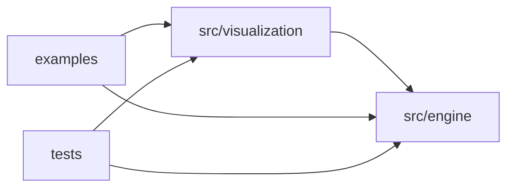

# Physics 2D

A 2D physics engine written from scratch as a learning project. The name is a working title and can change at any time.

> **Status:** Goal 0, foundation. There is no physics code yet.

## Requirements

- [Deno](https://deno.com) 2.9.x

## Commands

| Command                   | What it does                                                      |
| ------------------------- | ----------------------------------------------------------------- |
| `deno task verify`        | The full gate: format check, lint, type-check, doc lint and tests |
| `deno task test`          | Run all tests                                                     |
| `deno task test:coverage` | Run all tests and print a coverage report (`coverage/`)           |
| `deno task fmt`           | Format the code and the docs                                      |
| `deno task doc:html`      | Generate the API documentation into `build/api/`                  |

## Layout

```text
src/
  engine/         the physics engine: pure code, public API in mod.ts
  visualization/  renderers, cameras, viewports...: built on the engine, never the reverse
tests/
  architecture/   rules about the structure of the code itself
examples/         small applications that use the engine and a renderer (added when needed)
docs/             documentation; docs/.project holds the working agreement and the handover
```

Unit tests sit next to the code they test as `*.test.ts`. Cross-module tests go in `tests/` (`integration/` and `validation/` are created when the first test needs them).

## Dependency rule

Arrows mean "may import". The engine knows nothing about anything above it.



`tests/architecture/dependency-direction.test.ts` checks that the engine never reaches `src/visualization/`, `examples/` or `tests/`.

## Documentation

- [Scope and goals](docs/scope.md)
- [Roadmap](docs/roadmap.md): phases, chapters and gates
- [Conventions](docs/conventions.md): units, axes, time, errors, defaults
- [Architecture overview](docs/architecture/overview.md): modules, the engine boundary, enforcement
- [Decision records](docs/decisions/README.md): what was decided, and the alternatives rejected
- [Lessons learned](docs/lessons.md): what each chapter taught us
- [Working agreement](docs/.project/workflow.md)
- [Handover](docs/.project/handover.md): where the project stands and how to resume it
