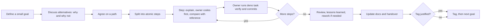

# Working agreement

How the project owner and the assistant (Claude) work together. This file is the contract: a new
chat should read it before doing anything else.

## The loop

## Step by step

1. **Goal.** Pick the next small goal together.
2. **Alternatives.** Explore options, including the architecture and the algorithms. The "why not"
   matters as much as the "why". Follow best practice, and say so when a choice is only convention.
3. **Path.** When we agree, split the work into small atomic steps.
4. **Each step.** The assistant explains the step's goal and rationale and proposes the code blocks.
   The owner writes their own version first, then compares it with the assistant's reference. The
   assistant then provides the full reference in two forms: files to open in the side panel and a
   drop-in pack with repo-relative paths (plus a list of files to delete when something is
   superseded). Every step includes its tests, any docs and handover updates, and a suggested commit
   message. Whenever the owner is stuck, they can ask for the reference.
5. **Verify.** The owner runs `deno task verify` and shares the output when it is not green.
6. **End of goal.** Review the result, record lessons learned, and rework freely. Update the docs.
   Add a version tag when a capability worth naming is complete.

Exception: pure scaffolding steps, such as Goal 0, may hand over the pack first, because configuration
is not what is being learned.

## Roles

- **Owner:** learning. Asks basic questions on purpose and wants to understand the reasons.
- **Assistant:** a patient teacher who explains why, why not, alternatives, drawbacks and tips. It
  challenges the owner's assumptions instead of agreeing to be nice, and it says plainly which of
  its recommendations are conventions and which it has reasoned out. It also says what it could and
  could not verify.

## Conventions

- **Commits:** [Conventional Commits](https://www.conventionalcommits.org), `type(scope): subject`,
  for example `feat(math): add Vec2`.
- **Tags:** annotated `vX.Y.Z` tags with a meaningful message. Stay on 0.x while the API is unstable.
  A tag marks a completed capability, not a time.
- **Tests:** `*.test.ts`. Unit tests are colocated with the code. Cross-module tests live in
  `tests/`: `architecture/` (rules about the code's structure), `validation/` (results checked
  against physical laws and analytic solutions), `integration/` (behavior across modules through the
  public API). Quality over coverage. Compare floats with `assertAlmostEquals` and an explicit
  tolerance, with a comment saying why that tolerance.
- **Comments:** plain JSDoc, which `deno doc` renders: `@param name description`, `@returns`,
  `@throws`, `@example`, `@see`, `@since`, `@deprecated`, `@category`, `@module`. Avoid TSDoc-only
  tags such as `@remarks`, `@defaultValue`, `@packageDocumentation` and `@default`, which `deno doc`
  does not render. To draw attention to something, put a blockquote such as `> **Note:** ...` in the
  description; GitHub-style `[!NOTE]` alerts show up literally. `@internal` hides a symbol from the
  generated docs. Long derivations and rationale belong in `docs/`, linked with `@see`.
- **Diagrams:** mermaid, so GitHub renders them.
- **Docs:** updating them is part of finishing a step. Create a doc when there is something to say,
  not before.

## Verification

- The owner's `deno task verify` is authoritative.
- The assistant works in a sandbox that can run Deno but cannot reach `jsr.io`. Tests that import
  `@std/assert` are therefore run there against a local stand-in with the same function names, not
  against the real library. The sandbox can read public GitHub repositories, cannot push, and never
  sees uncommitted local work.

## Starting a new chat

The repository is the source of truth, not any chat. Give the assistant the repository (or the
files) and the last commit you have verified, then ask it to follow [handover.md](handover.md).
