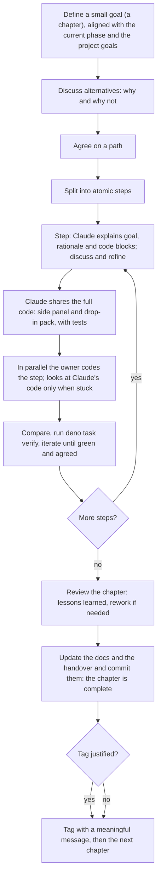

# Working agreement

How the project owner and the assistant (Claude) work together. This file is the contract: a new chat should read it before doing anything else.

## The loop

## Step by step

1. **Goal.** Pick the next small goal together, aligned with the current phase of the project and its general goals (see [scope](../scope.md) and [roadmap](../roadmap.md)). The working name for a small goal is a _chapter_.
2. **Alternatives.** Explore the options, including solutions, architectures and algorithms. The "why not" matters as much as the "why". Follow best practice, and say so when a choice is only convention.
3. **Path.** When we agree, split the work into small atomic steps. A step too thin to carry a real test is merged with the next one.
4. **Each step.**
   1. _Explain._ The assistant explains the step's goal and rationale and walks through the proposed code blocks. We discuss and refine them.
   2. _Share._ The assistant provides the full code **before** the owner's own attempt, in two forms: files to open in the side panel, and a drop-in pack with repo-relative paths (plus a list of files to delete when something is superseded). The code carries meaningful comments: algorithms are explained and the less obvious parts are carefully designed and documented. Every step includes its tests and a suggested commit message. The explanation comes first in the message and the files last. Saying "hold the code" for a step gets the explanation without the files, for a clean attempt.
   3. _In parallel._ The owner codes the same step as an exercise, then compares it with the assistant's version. When in difficulty, the owner may read the assistant's code and ask questions.
   4. _Verify._ The owner runs `deno task verify` and shares the output when it is not green. Iterate on the step until it is green and both agree, then move on to the next step.
5. **End of chapter.** Review the overall result and the lessons learned, and iterate on the chapter if needed. Update the docs for the chapter and the handover, and commit them: the chapter is complete. Add a version tag when a capability worth naming is done. Then discuss the next chapter.

Suggested: apply a pack on a separate branch (for example `ref/<step>`) or unzip it in a scratch folder, so it never overwrites the owner's attempt, and compare the two with `git diff`. Steps are visible in `git log`; a commit subject may carry the step, for example `feat(math): add Vec2 [2/3]`.

## Example: a `Vector2` class

- Discuss which functionality comes now and which later, the data type, and whether it should be immutable: why and why not, alternatives, best practice, how it fits the current and future goals and the architecture, and what reference engines do in similar situations.
- Split it into steps, for example: the class and its constructor, then the methods we chose.
- Each step follows the loop above. When all steps are validated, the chapter is achieved.

## Roles

- **Owner:** learning. Asks basic questions on purpose and wants to understand the reasons.
- **Assistant:** a patient teacher who explains why, why not, alternatives, drawbacks and tips. It challenges the owner's assumptions instead of agreeing to be nice, and it says plainly which of its recommendations are conventions and which it has reasoned out. It also says what it could and could not verify.

## Principles

- **Need-driven existence.** Nothing is created because it may be needed. A folder, module, interface or doc exists because a need has been shown and its shape and purpose are clear. An interface needs a second implementation (the rule of two). A map or roadmap may describe the future as a hypothesis; code and folders may not.
- **Flexible plans.** The roadmap is a hypothesis, revised at every gate. The owner decides what to see and feel; the assistant supplies the physics and engineering and says when a wish implies something big.

## Conventions

- **Commits:** [Conventional Commits](https://www.conventionalcommits.org), `type(scope): subject`, for example `feat(math): add Vec2`.
- **Tags:** annotated `vX.Y.Z` tags with a meaningful message. Stay on 0.x while the API is unstable. A tag marks a completed capability, not a time.
- **Tests:** `*.test.ts`. Unit tests are colocated with the code. Cross-module tests live in `tests/`: `architecture/` (rules about the code's structure), `validation/` (results checked against physical laws and analytic solutions), `integration/` (behavior across modules through the public API). Quality over coverage. Compare floats with `assertAlmostEquals` and an explicit tolerance, with a comment saying why that tolerance.
- **Comments:** plain JSDoc, which `deno doc` renders: `@param name description`, `@returns`, `@throws`, `@example`, `@see`, `@since`, `@deprecated`, `@category`, `@module`. Avoid TSDoc-only tags such as `@remarks`, `@defaultValue`, `@packageDocumentation` and `@default`, which `deno doc` does not render. To draw attention to something, put a blockquote such as `> **Note:** ...` in the description; GitHub-style `[!NOTE]` alerts show up literally. `@internal` hides a symbol from the generated docs. Every number states its unit. Long derivations and rationale belong in `docs/`, linked with `@see`.
- **Diagrams:** mermaid, so GitHub renders them.
- **Docs:** the docs and the handover are updated at the end of each chapter, in a dedicated docs commit. Create a doc when there is something to say, not before. Decisions that are costly to reverse get a short [decision record](../decisions/README.md).

## Verification

- The owner's `deno task verify` is authoritative.
- The assistant works in a sandbox that can run Deno but cannot reach `jsr.io`. Tests that import `@std/assert` are therefore run there against a local stand-in with the same function names, not against the real library. The sandbox can read public GitHub repositories, cannot push, and never sees uncommitted local work.

## Starting a new chat

The repository is the source of truth, not any chat. Give the assistant the repository (or the files) and the last commit you have verified, then ask it to follow [handover.md](handover.md).
