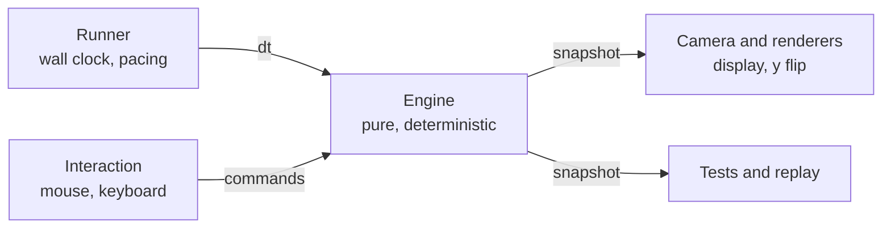
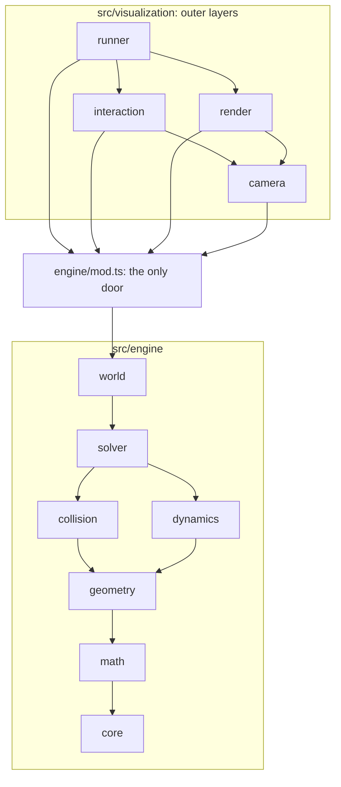
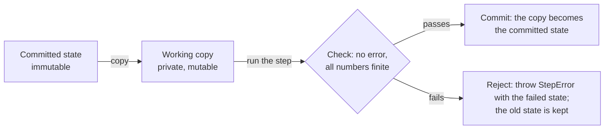

# Architecture overview

The engine is a pure, deterministic island. Everything that touches the outside world (time, input, display) lives in outer layers that talk to the engine through one door. The reasoning and the rejected alternatives are in [ADR 0004](../decisions/0004-engine-boundary.md) and [ADR 0005](../decisions/0005-module-structure-and-enforcement.md).

## Big picture

The engine knows nothing about clocks, mouse events or the display. Snapshots are read-only.

## Module map

This is the target map. A folder appears with the chapter that needs it (see [How modules appear](#how-modules-appear)).

Arrows mean "may import". Each module may import only what is below it, and `world` may use any lower module. `collision` and `dynamics` are siblings on purpose: collision answers "do these shapes overlap?" from shapes and transforms alone, and must not know what a body or a mass is. That keeps it reusable for queries such as picking.

| Module        | Responsibility                                                              | First chapter | May import                                 |
| ------------- | --------------------------------------------------------------------------- | ------------- | ------------------------------------------ |
| `core`        | errors and validation helpers                                               | A1            | nothing                                    |
| `math`        | `Vector2` and later rotation helpers                                        | A1            | core                                       |
| `geometry`    | shapes, transforms, area and inertia                                        | B1            | core, math                                 |
| `collision`   | shape-pair tests, contacts                                                  | B2            | core, math, geometry                       |
| `dynamics`    | bodies, mass, forces, integrators                                           | A1 to A3      | core, math, geometry                       |
| `solver`      | contact response, later joints                                              | B3            | everything below                           |
| `world`       | owns the state; commands, the step pipeline, the commit, snapshots, queries | A1            | everything below                           |
| `runner`      | the real-time driver: loop and pacing                                       | A2            | the engine's `mod.ts`, render, interaction |
| `render`      | canvas and SVG drawing                                                      | A2            | the engine's `mod.ts`, camera              |
| `camera`      | zoom, pan, the world-to-screen transform                                    | A4            | the engine's `mod.ts`                      |
| `interaction` | input turned into commands                                                  | B4            | the engine's `mod.ts`, camera              |

The outer layers import only `engine/mod.ts`, never engine internals. Anything not exported from a module's `mod.ts` is internal and may change without notice. The name of the outer folder is deliberately open until chapter A2, when the runner arrives and the folder holds more than visualization.

## The engine boundary

The engine's front door has three verbs:

- **Command** (write): add and remove bodies, set a velocity, apply an impulse, change the gravity.
- **Step** (advance): `step(dt)` moves the world forward by exactly `dt`, deterministically.
- **Observe** (read): snapshots, and read-only queries such as "which body is under this point?".

Keeping queries separate from commands is what lets interaction work without touching internals.

**Descriptions in, handles out.** A caller passes plain descriptions. The world validates and copies them and returns opaque ids. The caller never holds the engine's objects, so it cannot change them behind the engine's back.

**A step is atomic.** The committed state is never edited in place. A step works on a private copy and publishes it only if everything succeeded:

- The engine keeps exactly one committed state. The old one is dropped on commit; an observer that pulled it earlier keeps it alive by its own reference.
- "Stable" means valid, not at rest: moving bodies are normal.
- Because the engine is deterministic, repeating a failed step fails identically. The runner must stop and surface the error. The previous state, the `dt` and the commands reproduce the failure exactly.
- The committed state must hold everything the next step reads (for instance a warm-start cache, when it exists), or replays diverge.

**Snapshot and checkpoint.** A snapshot is a photo: what an observer can see. A checkpoint is a save game: everything needed to resume with exactly the same future. They start identical and diverge when the first hidden state appears, so only `snapshot()` exists until replay or undo needs a checkpoint.

| Item                              | Snapshot | Checkpoint |
| --------------------------------- | -------- | ---------- |
| Bodies, shapes, positions, angles | yes      | yes        |
| Velocities                        | yes      | yes        |
| Step number and simulated time    | yes      | yes        |
| Warm-start cache (later)          | no       | yes        |
| Sleep timers (later)              | no       | yes        |

## Enforcement policy

Architecture is mostly a conception and a directive: expose only the intended API through each `mod.ts`, document it (`deno task doc:lint` requires JSDoc on every export), and trust the reader. One rule is also executable, because it is the project's identity, easy to break by accident and hard to notice:

- The engine never reaches `src/visualization/`, `examples/` or `tests/` (`tests/architecture/dependency-direction.test.ts`), and `check:engine` and `check:visualization` run separately so that DOM types cannot leak into the engine.

A table of allowed imports between engine modules is deferred. Its trigger is the first wrong-direction import that slips through, or about five modules, whichever comes first.

## How modules appear

A folder, an interface or a doc is created when a chapter shows a need and its shape and purpose are clear. The map above is a hypothesis, and the "first chapter" column says when each module is expected to earn its place. An interface follows the rule of two: it is introduced only when a second implementation exists. The first likely case is explicit versus semi-implicit Euler in chapter A3.

## Open items

- The name and shape of the outer folder (chapter A2).
- Whether pick and drag are a force or a constraint (chapter C4).
- Stable ids and body removal (designed in A1, exercised in C4).
