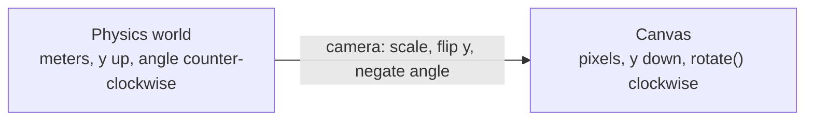

# Conventions

Rules that every module inherits. The reasons and the rejected alternatives are in [ADR 0002](decisions/0002-conventions.md) and [ADR 0003](decisions/0003-mass-in-a-2d-world.md).

## At a glance

| Convention    | Rule                                                                                                                      |
| ------------- | ------------------------------------------------------------------------------------------------------------------------- |
| Units         | SI: meters, kilograms, seconds, newtons, radians. Objects are sized roughly 0.1 to 10 m, because tolerances are in meters |
| Axes          | x to the right, y up                                                                                                      |
| Angles        | radians, counter-clockwise positive                                                                                       |
| Numbers       | JavaScript `number` (64-bit float) everywhere                                                                             |
| Time          | the engine advances by the `dt` it is given; callers use a fixed `dt` (for example 1/60 s)                                |
| Determinism   | same inputs, same results on the same runtime: no `Math.random`, no `Date.now`, stable iteration order                    |
| Mass          | the 2D world is a slice 1 m thick: mass = density (kg/m³) × area × 1 m                                                    |
| Errors        | validate everything that enters the engine and throw; inside hot loops assume valid input                                 |
| Defaults      | documented constants for the environment and for materials, never for geometry                                            |
| Magic numbers | every tolerance and threshold is a named, documented constant with its unit                                               |
| Units in docs | every numeric field and parameter states its unit in its JSDoc                                                            |

## World and screen

The physics world is y-up and counter-clockwise positive. A canvas is y-down and its `rotate()` is clockwise-positive. The flip happens in exactly one place, the camera, which also negates angles. The engine never sees pixels.



## Time and determinism

The world offers one deterministic, single-pass `step(dt)`. Something outside the engine decides when to call it (a game loop, `requestAnimationFrame`, a test). There are two different things called a simulation: a stepper that owns `dt` and _simulated_ time and never reads a clock (it can live next to the engine), and a real-time driver that turns frame timing into steps (it lives in the outer layers). Determinism plus a recorded list of `dt` values and commands reproduces any run exactly.

Bit-identical results across different JavaScript engines are not promised: the language does not pin down the results of functions such as `Math.sin`.

## Errors and validation

Everything that enters the engine (constructors, setters, commands) is validated, and invalid input throws. A message names the parameter, the received value, the valid range and the unit:

```text
RangeError: gravity must be a finite number (m/s²), received NaN
```

Inside the step loop values are not re-validated. They are protected by invariants and tests, and a step is committed only if it raised no error and every number is finite (see [the engine boundary](architecture/overview.md#the-engine-boundary)).

## Defaults and constants

User parameters are minimal and optional. When one is omitted the engine uses a sane Earth-like default, held as a documented constant owned by the module that uses it (for example gravity `(0, -9.81)` m/s²). An override is optional and validated, at instantiation and at runtime. The world exposes its effective configuration, so you can always see which defaults were applied.

Defaults exist for the environment and for materials, never for geometry. A circle's radius is required, because a default size would be a silent guess.

## Mass

Mass needs a volume and a 2D world only has area, so the world is treated as a slice 1 m thick. A body's mass is its density times its area times 1 m. Real material tables work as they are (wood is about 700 kg/m³, water 1000), at the price of a stated pretend third dimension. Default material values are decided in the materials chapter, with cited sources.

Because the numbers are those of an area density in kg/m², the other engines' habits apply as well: a water-density disc the size of a football weighs about 38 kg, and only mass ratios matter for gravity-only motion. Interaction tools therefore set a velocity change (Δv), not newtons.

## Documenting units

```ts
/**
 * Applies an instantaneous change of velocity.
 *
 * @param id The body.
 * @param deltaVelocity Velocity change in meters per second (m/s).
 */
```
