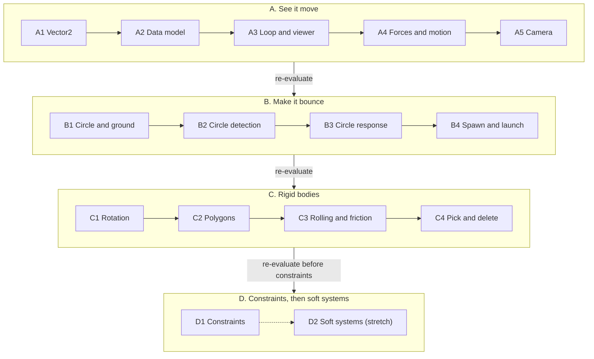

# Roadmap

A **chapter** (the working name for a small goal) is one unit of work: discussed with alternatives, split into steps, implemented, documented and, when it deserves one, tagged. A **phase** is a group of chapters between two gates. At a **gate** we stop and re-evaluate the plan.

> The roadmap is a hypothesis. Only the next chapter is planned in detail, and every gate may change what follows.

## Chapters

| Chapter                   | Content                                                                               | What you can watch                           |
| ------------------------- | ------------------------------------------------------------------------------------- | -------------------------------------------- |
| A1 Vector2                | the immutable 2D vector: add, sub, scale, dot, length                                 | tests only                                   |
| A2 Data model             | a body and a world with a shapeless body; commands, step and snapshots; `core`        | tests only                                   |
| A3 Loop and viewer        | a deterministic stepper, a real-time runner, a basic canvas viewer; constant velocity | dots drifting across the canvas              |
| A4 Forces and motion      | gravity, springs, two integrators validated against analytic solutions                | a ball flies a parabola; a spring oscillates |
| A5 Camera                 | zoom, pan, the world-to-screen transform                                              | navigating the scene                         |
| B1 Circle and ground      | the circle shape, a static ground, mass from density                                  | a circle resting on a floor line             |
| B2 Circle detection       | contacts between circles and the ground, debug drawing                                | contact points and normals on screen         |
| B3 Circle response        | restitution and rest, sliding friction                                                | the ball bounces, then slides to rest        |
| B4 Spawn and launch       | mouse adds bodies with a velocity                                                     | throwing balls around                        |
| C1 Rotation               | angle, angular velocity, inertia from shape and density                               | spinning bodies                              |
| C2 Polygons               | convex polygons (a box first), overlap tests and contact points                       | boxes collide                                |
| C3 Rolling and friction   | rotation inside the response; rolling resistance as an explicit approximation         | the ball rolls and stops; boxes tumble       |
| C4 Pick and delete        | the query under the cursor, dragging, removing bodies safely                          | grab and delete bodies with the mouse        |
| D1 Constraints            | joints, the pendulum, compound bodies, stacking stability                             | a pendulum swings; stacks stand              |
| D2 Soft systems (stretch) | ropes and cloth built from particles and constraints                                  | a rope sags; a cloth drapes                  |

## Why this order

- **A viewer comes early** (A3). It is the best debugging instrument the project will have, and it lets you see the work.
- **Forces come with gravity** (A4). Springs have exact analytic solutions, so they are the cheapest way to validate integrators, and they define how forces enter the system before collisions exist.
- **Circles collide before rotation and polygons** (B before C). The first "ball bounces" win comes early, and the number of shape-pair tests stays small (N shape types need N(N+1)/2 tests). The cost is deliberate rework: the response is re-derived in C3 when rotation enters it (the cross terms appear). The alternative, rotation first, would derive the solver once but delay the first bounce.
- **The capsule is deferred.** It adds several pair tests for little gain; a polygon with a rounding radius could cover it later.
- **Interaction is split.** Spawn and launch are cheap (B4). Pick, drag and delete come later (C4) because deleting forces the body-removal design, and dragging properly means a force or a constraint, not "teleport to the mouse".
- **The camera can go almost anywhere** after the viewer. Its world-to-screen math is pure, so it is testable without a browser.

## Parking lot

Stacking stability, sleeping, a broadphase, materials, friction details, continuous collision detection, render interpolation. Each moves into a chapter when a gate shows the need.
